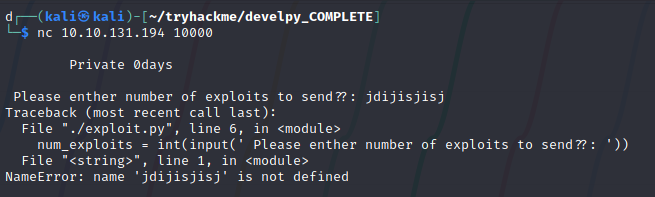
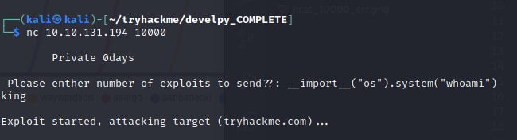
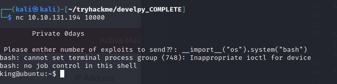
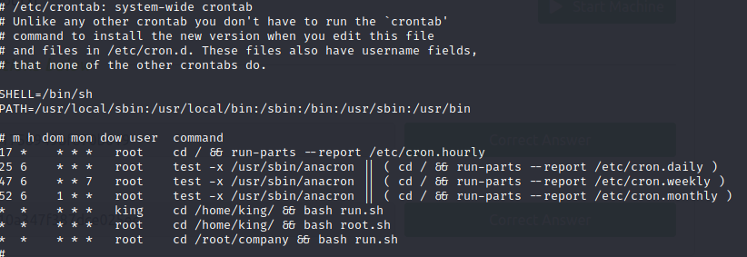
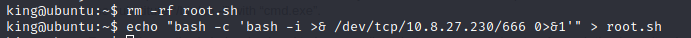
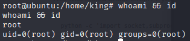

# Develpy Writeup

## Introduction
Develpy is a medium box on the Tryhackme platform. Involving abusing a python input() function and exploiting  a poorly configured cron job.

## Initial Scanning

Starting off by running a basic top 1000 Nmap scan only brings port 22 back which tells me we need to increase our scope. So I continue with a full port nmap scan which brings back the following results:

```bash
Command: nmap -p- -oN nmap/develpy-allPorts <IP>

Output:
Scanned at 2021-07-23 18:17:21 EDT for 103s
Not shown: 65533 closed ports
Reason: 65533 conn-refused
PORT      STATE SERVICE          REASON
22/tcp    open  ssh              syn-ack
10000/tcp open  snet-sensor-mgmt syn-ack
```

Looking into port 10,000 a further nmap scan brings back no more useful information so I just connect to the port via netcat and got an input as a response. Putting junk into the input gives me the following error:



This tells me I'm dealing with python based application and the input uses the input() function. This means that if the program is running python2 it will evaluate anything within the input. The correct usage in python2 is raw_input(). I test this by importing the os module using the `__import__` function to try and run a system command. This gives me RCE on the box.



## Getting a shell

After gaining RCE I tried a few reserve shells to try and gain a terminal on the box. This did not produce any results. After being stuck for a while I decided to just try and run bash directly in the system function and to my surprise this gave me a shell as the king user. Definitely a lesson in trying simple things first!



## Privilege Escalation

the next thing i need to do is escalate from the king user to the root user. After running basic linux privilege escalation techniques I come across the /etc/crontab file within the file there is a script called root.sh being ran periodically with root privileges.



With the root.sh file being located in king's home directory this means i have full read write control over it. So I can remove the original root.sh and create my own with a reverse shell in it like so:



Now we just start a netcat listener on port 666 and wait for the crontab to run the script and give us a connection.



With that I have root. This box was interesting overall and I learned a few python tricks throughout such as the `__import__` function to get a one line os import. My main takeaway from this box was not to overlook simple solutions especially trying to get the shell I spent way too long over complicating the necessary steps. 